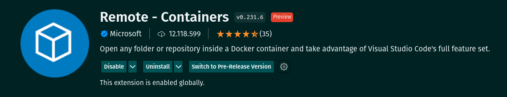

# Welcome to the Talker Manager project repository!

# Development

  
<strong>👨‍💻 What was developed</strong>
 

  This is an application for registering talkers (speakers) in which it will be possible to register, view, search, edit and delete information. For this you must:
  1. An API was developed for a `CRUD` (**C**reate, **R**ead, **U**pdate and **D**elete) of speakers (talkers) and;
  2. We developed some endpoints that will read and write to a file using the `fs` module.

# guidelines

  
<strong>:whale: Running in Docker vs Locally</strong>
 
  
  ## With Docker
 
  > Run the `node` service with the command `docker-compose up -d`.
  - This service will initialize a container called `talker_manager`.
  - From here you can run the container via CLI or open it in VS Code.

  > Use the command `docker exec -it talker_manager bash`.
  - It will give you access to the interactive terminal of the container created by compose, which is running in the background.

  > Install dependencies [**If any**] with `npm install`

 

  ---
  
  ## No Docker
  
  > Install dependencies [**If any**] with `npm install`

  :eyes: **Looking for tips:**
  1. To run the project this way, you **must** have `node` installed on your computer.
  2. The evaluator expects the `node` version used to be 16.

  
<strong>🔁 Live reload</strong>
 

  [Nodemon](https://nodemon.io) was used to monitor changes to files and restart the server automatically.

  This project already comes with _nodemon_ related dependencies configured in the `package.json` file.

  To start the server in development mode just run the command `npm run dev`. This command will make the server restart automatically when saving a modification made to the project files.

